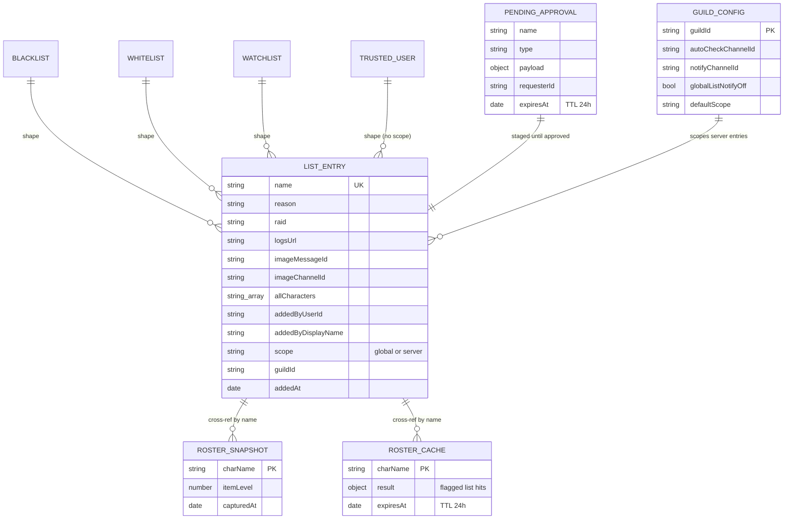
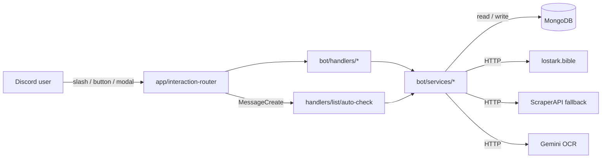

# Lost Ark Discord Bot

Discord bot for a small Lost Ark guild. Monitors server status, looks up rosters from `lostark.bible`, and runs a cross-server blacklist / whitelist / watchlist with OCR-based screenshot checking and Stronghold-based alt detection.

## Features

- **Server monitoring** — polls one or more servers (default Brelshaza), posts `@here` on offline-to-online transitions, `/la-status` for live check
- **Roster lookup** — `/la-roster` scrapes `lostark.bible`, tracks iLvl progression, cross-checks every list; `deep:true` runs Stronghold alt detection
- **List management** — blacklist / whitelist / watchlist (`⛔` / `✅` / `⚠️`), global or server-scoped, trusted users protected from any list
- **Bulk add** — `/la-list multiadd` downloads an Excel template (max 30 rows), single aggregated approval DM, single aggregated broadcast
- **Screenshot OCR** — `/la-check` or drop in an auto-check channel, Gemini extracts ≤ 8 names and cross-checks; auto-failover across Gemini models on quota
- **Quick Add** — after auto-check, dropdown adds unflagged names straight to blacklist/watchlist via modal
- **Approval flow** — members submit, officers instant-approve; senior approver always receives the DM
- **Evidence rehosting** — images uploaded with an entry are rehosted into a pinned evidence channel so Discord's 24h CDN expiry doesn't rot the reference
- **ScraperAPI fallback** — direct fetch to `lostark.bible` first, auto-fallback through up to 3 ScraperAPI keys on 403/503; high-fanout roster/list/OCR paths keep ScraperAPI off by default
- **ScraperAPI usage visibility** — `/la-stats` shows process-lifetime ScraperAPI request totals, success/failure split, network errors, and per-key counts
- **Guild-only commands** — `setDMPermission(false)` on every slash command; nothing runs in DMs

## Commands

| Command | Description |
|---|---|
| `/la-status` | Live server status |
| `/la-reset` | Reset the stored server status state |
| `/la-roster name [deep] [deep_limit]` | Fetch roster, progression delta, cross-check lists. `deep:true` runs Stronghold alt scan and is **restricted to officers/seniors** (it depends on the bot owner's residential-IP worker). Plain `/la-roster name` without the deep flag is open to everyone |
| `/la-search name [min_ilvl] [max_ilvl] [class]` | Search similar names (default iLvl ≥ 1700), cross-check all lists |
| `/la-list add type name reason [raid] [logs] [image] [scope]` | Add to blacklist/whitelist/watchlist. `scope`: `global` / `server` (blacklist only) |
| `/la-list edit name [reason] [type] [raid] [logs] [image] [scope] [additional_names]` | Edit existing entry (owner/officer instant, members via approval). `additional_names` appends alts manually for hidden-roster + no-guild edge case |
| `/la-list remove name` | Remove an entry (ownership check) |
| `/la-list view type [scope]` | View entries. `scope`: `all` / `global` / `server` |
| `/la-list trust action name [reason]` | Manage trusted list — `add` / `remove` (officer/senior only) |
| `/la-list enrich name [deep_limit]` | Stronghold deep-scan an existing entry and append discovered alts. **Restricted to officers/seniors** (depends on the bot owner's residential-IP worker; ~10-15 min wall clock) |
| `/la-list multiadd action [file]` | Bulk add via Excel template (≤ 30 rows). `action:template` downloads, `action:file` uploads |
| `/la-check image` | OCR a screenshot → cross-check names against all lists |
| `/la-help` | Show all commands |
| `/la-setup autochannel #channel` | Set auto-check channel (Manage Server) |
| `/la-setup notifychannel #channel` | Set notification channel (Manage Server) |
| `/la-setup view` | View current channel config |
| `/la-setup off` | Toggle global-list notifications on/off for this server |
| `/la-setup defaultscope global/server` | Set default scope for `/la-list add` |

### Status Icons

| Icon | Meaning |
|---|---|
| ⛔ | Blacklisted |
| ✅ | Whitelisted |
| ⚠️ | Watchlist (under investigation) |
| ❓ | Not in any list, roster exists |
| 🛡️ | Trusted user (cannot be added to any list) |
| `[S]` | Server-scoped blacklist entry |
| `[S:Name]` | Server-scoped entry with server name (owner view) |

## Data Model

Ten MongoDB collections. Entries are keyed by character name (case-insensitive) with a compound unique index on `(name, scope, guildId)` so the same name can live in `global` and one or more `server`-scoped entries without collisions.



Blacklist / Whitelist / Watchlist share the same shape; only the collection name and the list-semantics icon differ. TrustedUser is a subset (no scope, no raid/logs — just name + reason). `allCharacters[]` on every list entry holds the known alt names from a Stronghold-based roster scan, indexed for fast `$in` cross-checks during `/la-check` and auto-check.

Sample blacklist document:

```jsonc
{
  "name": "Lazy",
  "reason": "RMT",
  "raid": "Brelshaza Hard",
  "logsUrl": "https://lostark.bible/character/NA/Lazy/logs",
  "imageMessageId": "1234567890",
  "imageChannelId": "9876543210",
  "allCharacters": ["Lazy", "LazyAlt1", "LazyAlt2"],
  "addedByDisplayName": "Senior Officer",
  "scope": "global",
  "guildId": "",
  "addedAt": "2026-04-12T10:00:00Z"
}
```

**Scope priority.** When both `global` and `server` entries exist for the same name, the server entry takes precedence in view/check output. The owner guild (`OWNER_GUILD_ID`) sees every server-scoped entry with a `[S:GuildName]` label; other guilds only see their own server-scoped rows plus everything `global`.

## Architecture

```
LostArk_LoaLogs/
|-- bot.js                         # Minimal Discord client entrypoint
|-- loa-worker.js                  # Bible worker process entrypoint
|-- dusk-check.js                  # Diagnostic helper (local dev only)
|
|-- bot/
|   |-- app/                       # Startup, slash registration, interaction router
|   |   |-- command-registration.js
|   |   |-- interaction-router.js
|   |   `-- lifecycle.js
|   |-- commands/                  # SlashCommandBuilder registry
|   |   `-- index.js
|   |-- config.js                  # Env var loading + validation
|   |-- db.js                      # Mongoose lazy singleton connect
|   |-- monitor/                   # Server status polling
|   |   |-- monitor.js
|   |   `-- serverStatus.js
|   |-- handlers/
|   |   |-- system/                # /la-status, /la-reset
|   |   |-- meta/                  # /la-help, /la-stats
|   |   |-- setup/                 # /la-setup, /la-remote, image migration
|   |   |-- search/                # /la-search command + evidence UI
|   |   |-- roster/                # /la-roster visible/hidden/deep scan flows
|   |   `-- list/                  # /la-list, /la-check, quick add, multiadd, enrich
|   |       |-- index.js           # List command family factory wiring
|   |       |-- auto-check.js      # Auto-check channel listener
|   |       |-- helpers.js
|   |       |-- services/          # List add/edit/broadcast/approval closures
|   |       |-- add/               # Add command + approval/evidence buttons
|   |       |-- edit/              # Edit command + approval/apply handlers
|   |       |-- remove/            # Remove command
|   |       |-- view/              # List view UI
|   |       |-- check/             # Slash screenshot check
|   |       |-- trust/             # Trusted list management
|   |       |-- quickadd/          # Quick-add dropdown from OCR results
|   |       |-- enrich/            # Stronghold alt enrichment flow
|   |       `-- multiadd/          # Template upload + approval flow
|   |-- services/
|   |   |-- discord/              # Discord application emoji bootstrap
|   |   |-- list-check/           # Gemini OCR, OCR formatting, matching, cache policy, enrichment
|   |   |-- multiadd/             # Excel template/parser facade + internals
|   |   |-- roster/               # lostark.bible client, parsers, search, roster/deep-scan helpers
|   |   `-- worker/               # Scrape queue worker + heartbeat
|   |-- utils/                    # Shared embeds, scan sessions, text/scope/cache/name helpers
|   `-- models/                   # Mongoose schemas + indexes
|
|-- assets/class-icons/            # Class icon PNGs for Discord application emoji
|-- exports/                       # Historical CSV/XLSX drops (gitignored)
|-- data/                          # Persisted runtime state
|-- test/                          # node --test coverage for handlers/services/utils
|-- Dockerfile
|-- railway.toml
|-- .env.example
`-- package.json
```

Five compose principles:

1. **Entry point stays thin.** `bot.js` only creates the Discord client, wires lifecycle/router modules, and installs process-level crash logging.
2. **Handlers follow feature folders.** Command families live under `handlers/<feature>/`; `handlers/list/index.js` is the list-family facade, while `handlers/list/auto-check.js` owns message-based screenshot checking.
3. **Services wrap external I/O by domain.** `services/roster/index.js` is the public lostark.bible facade, `services/list-check/service.js` owns Gemini OCR/list matching, `services/multiadd/index.js` owns Excel import/export, and `services/worker/*` owns background scrape work.
4. **Utilities stay pure where possible.** Cross-feature formatting/session helpers live under `utils/`; OCR/name cleanup is centralized in `utils/names.js` so slash check, auto-check, and list edits normalize the same way.
5. **Factory pattern for closure-dependent code.** Modules that need the Discord `client` export `create*({ client, ... })` factories. `app/interaction-router.js` builds those closures once and routes slash commands, buttons, modals, selects, and autocomplete through them.

Interaction flow:



Server monitor runs out-of-band: `bot/monitor/monitor.js` polls `bot/monitor/serverStatus.js` every `CHECK_INTERVAL` seconds, persists state to `data/status.json`, and posts transitions directly via the Discord client without going through the handler layer.

## Requirements

- Node.js ≥ 20
- MongoDB (Atlas or self-hosted)
- Discord bot token + channel ID
- Gemini API key (optional — only needed for `/la-check` + auto-check)
- Discord Privileged Intent: **Message Content Intent** (needed for auto-check)

## Environment Variables

Copy `.env.example` to `.env` and fill in values.

### Required

| Var | Notes |
|---|---|
| `DISCORD_TOKEN` | Bot token |
| `CHANNEL_ID` | Channel ID for server-online notifications |
| `MONGODB_URI` | MongoDB connection string |

### Optional

| Var | Default | Notes |
|---|---|---|
| `CHECK_INTERVAL` | `30` | Status check interval in seconds (min 10) |
| `TARGET_SERVERS` | `Brelshaza` | Comma-separated server names to monitor |
| `GEMINI_API_KEY` | — | Gemini API key for OCR |
| `GEMINI_MODELS` | `gemini-2.5-flash,...` | Comma-separated model priority list (failover) |
| `LISTCHECK_ALT_ENRICHMENT` | `false` | Run background Stronghold alt scan after OCR hits; keep off to avoid request spikes |
| `LISTCHECK_ALT_ENRICHMENT_LIMIT` | `1` | Max flagged OCR names to enrich per screenshot when enrichment is enabled |
| `LISTCHECK_ALT_ENRICHMENT_CANDIDATE_LIMIT` | `80` | Max guild candidates checked per OCR background alt scan |
| `LISTCHECK_MAX_NAMES` | `8` | Max OCR names checked from one image |
| `LISTCHECK_ROSTER_LOOKUP_CONCURRENCY` | `3` | Parallel direct roster lookups during `/la-check` |
| `LISTCHECK_ROSTER_LOOKUP_START_SPACING_MS` | `150` | Start spacing between `/la-check` roster lookups |
| `LISTCHECK_ROSTER_LOOKUP_TIMEOUT_MS` | `6000` | Timeout for each direct `/la-check` roster/suggestion lookup |
| `LISTCHECK_SIMILAR_LOOKUP_LIMIT` | `3` | Max no-roster names that trigger similar-name suggestions |
| `OCR_CACHE_TTL_MS` | `300000` | Short-lived cache for repeated OCR of the same attachment URL |
| `OCR_CACHE_MAX_SIZE` | `100` | Max cached OCR attachment results |
| `GUILD_MEMBERS_CACHE_TTL_MS` | `900000` | Cache guild member lists for Stronghold deep/enrich scans |
| `GUILD_MEMBERS_CACHE_MAX_SIZE` | `200` | Max cached guild member lists |
| `STRONGHOLD_DEEP_CANDIDATE_LIMIT` | `300` | Max guild candidates checked by `/la-roster deep:true` |
| `STRONGHOLD_DEEP_CONCURRENCY` | `3` | Parallel candidate profile fetches in Stronghold deep scans |
| `STRONGHOLD_DEEP_CANDIDATE_TIMEOUT_MS` | `8000` | Timeout per Stronghold candidate lookup |
| `STRONGHOLD_DEEP_USE_SCRAPERAPI` | `false` | Low-level default for detector callers that do not override it; command handlers keep high-fanout scans off |
| `STRONGHOLD_DEEP_FAILURE_GUARD_MIN_CANDIDATES` | `25` | Candidate-attempt sample before auto-pausing a scan with extreme fetch failures |
| `STRONGHOLD_DEEP_FAILURE_GUARD_RATE` | `0.85` | Failed-attempt ratio that triggers the auto-pause guard (`0.85` = 85%) |
| `AUTO_CHECK_CHANNEL_IDS` | — | Global fallback for auto-check (prefer per-server `/la-setup`) |
| `LIST_NOTIFY_CHANNEL_IDS` | — | Global fallback for list notifications |
| `OFFICER_APPROVER_IDS` | — | Officer Discord user IDs (instant approval on `/la-list add`) |
| `SENIOR_APPROVER_IDS` | — | Senior approvers (always receive approval DMs) |
| `MEMBER_APPROVER_IDS` | — | Member approvers |
| `OWNER_GUILD_ID` | — | Owner/admin Discord server ID — can view every server-scoped blacklist entry |
| `SCRAPERAPI_KEY` | — | Primary ScraperAPI key (fallback proxy on 403/503) |
| `SCRAPERAPI_KEY_2` | — | Secondary key (used when primary hits 429 or invalid) |
| `SCRAPERAPI_KEY_3` | — | Tertiary key (final fallback) |

## Run Locally

```bash
npm install
cp .env.example .env    # then edit
npm start               # or: npm run dev (node --watch)
```

## Run with Docker

```bash
docker build -t lostark-discord-bot .
docker run --env-file .env --name lostark-bot lostark-discord-bot
```

## Deploy on Railway

1. Push code to the GitHub branch Railway tracks.
2. Create the Railway service → link repo.
3. In **Variables** tab, set every env var (minimum: `DISCORD_TOKEN`, `CHANNEL_ID`, `MONGODB_URI`).
4. Railway builds from `Dockerfile` (node:20-slim, `npm install --omit=dev`) and starts via `node bot.js`.
5. Flip **Message Content Intent** on in Discord Developer Portal if using auto-check channels, otherwise auto-check won't fire.

Slash commands register through Discord's global endpoint on boot (`ClientReady` handler), so a Railway redeploy is enough to push schema changes — no separate CLI step.

## Known Limitations

- `/la-roster` and `/la-search` scrape `lostark.bible` HTML/SvelteKit payloads. Layout changes upstream will break parsers under `services/roster/`.
- Discord CDN URLs on `imageUrl` (legacy entries) expire around 24h after upload. New entries use the `imageMessageId` + `imageChannelId` rehosting path; old entries may show a broken image.
- Gemini OCR quality on diacritic names depends heavily on screenshot resolution. Similar-name suggestion is the fallback when OCR misreads (`Lùnaria` vs `Lunaria`).
- ScraperAPI falls back on 403/503 but not on soft blocks that return 200 with empty HTML. If upstream silently cloaks, `/la-roster` returns "no roster found".
- ScraperAPI usage stats are in-memory process counters. They reset on bot restart/redeploy and estimate bot-side requests, not ScraperAPI billing-plan credits.
- One Mongo cluster, no sharding. List entries are small (≤ a few KB each) so this scales comfortably for a single-guild deployment.
- Approval TTL is 24h (`PendingApproval`). Members who submit and never get senior action see their request auto-expire instead of sitting forever.
- Auto-check has a 10s per-user cooldown to prevent screenshot spam from wedging Gemini quota.
